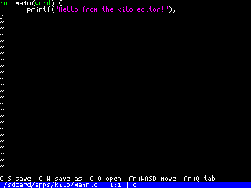
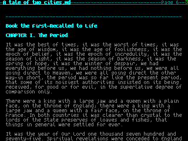
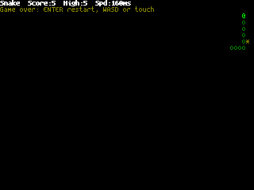

# Esposito Apps

Dynamic apps that run on Esposito OS. Each app is compiled to a self-contained ELF and loaded from the SD card at runtime.

## App API

Apps are linked against a small OS API surface that is exported by the firmware.
The exact symbol list lives in `main/os_symtab.c`, but the main groups are:

### App lifecycle

- `app_init(app_context_t *ctx)` sets subscriptions and initializes the app.
- `app_event(app_context_t *ctx, event_t *event)` receives timer, keyboard, touch, and serial events.
- `app_checkpoint(app_context_t *ctx)` saves state before the app switches away.
- `app_close(app_context_t *ctx)` releases resources and clears the display.

### App switching and startup files

- `os_load_app(name)` launches another app.
- `os_open_app_with_file(name, path)` stores a startup file for the target app and launches it.
- `os_consume_startup_file(out, size)` reads and clears that startup file during app startup.

### Time and NTP

- `os_get_time_status(&status)` returns the current UTC time and whether the clock is trusted.
- `os_time_is_synchronized()` returns whether NTP has synced during this boot.
- `os_time_last_sync()` returns the Unix timestamp of the last successful sync.

### Direct pixel drawing

Apps can bypass the text grid and draw directly to the 320×240 display using RGB565 color values (each component encoded as 5 or 6 bits packed into a `uint16_t`).

- `display_clear(color)` fills the whole screen with `color`.
- `display_draw_pixel(x, y, color)` draws a single pixel.
- `display_fill_rect(x, y, w, h, color)` fills a rectangle.
- `display_draw_text(x, y, text, color)` draws text at pixel coordinates with transparent background.
- `display_draw_text_bg(x, y, text, fg, bg)` draws text with an explicit background color.
- `display_draw_char_at(x, y, ch, fg, bg)` draws one character at pixel coordinates.
- `display_set_font(font_ptr)` selects the active font (use `font_table[FONT_*].font_ptr`).
- `display_measure_scaled_text(text, scale, &w, &h)` returns pixel dimensions for a scaled string.
- `display_draw_scaled_text_bg(x, y, text, fg, bg, scale)` renders text with each source pixel blown up to `scale×scale` squares, using the same glyph-bitmap decoder as the screenshot engine. Good for large clock digits or titles.

### JPEG and image rendering

- `display_get_jpg_size(path, &width, &height)` reads a JPEG file header and returns image dimensions without decoding.
- `display_draw_jpg_fit(path, x, y, max_w, max_h, scale_div)` decodes and renders a JPEG at specified coordinates, scaled to fit within bounds. `scale_div` uses hardware divisors (1.0, 0.5, 0.25, or 0.125).

### Input handling

- `keyboard_read_event(&key, &pressed)` reads keyboard events (BBQ20 keyboard on serial).

These functions work alongside text mode — `paint` uses `display_draw_pixel` and `display_fill_rect` for canvas drawing while keeping text-mode-style UI at the top. The `clock` app uses `display_draw_scaled_text_bg` for the large time readout. The `image_viewer` app uses `display_draw_jpg_fit` for JPEG rendering.

### Display and text mode

- `text_mode_init()` / `text_mode_init_ex(font)` select the text grid.
- `text_mode_print_at*()` and `text_mode_printf_at*()` draw text.
- `text_mode_clear()` clears the screen.
- `text_mode_flush()` commits buffered text updates.

### Checkpoint and config

- `checkpoint_save_*()` / `checkpoint_load_*()` store app state in the app checkpoint.
- `config_bind_app(name)` / `config_unbind_app()` select an app config namespace.
- `config_get_*()` and `config_set_*()` read and write app settings.

### Files and system helpers

- Standard C I/O helpers such as `fopen`, `fread`, `fwrite`, `fclose`, `fseek`, and `ftell` are available.
- Directory helpers such as `opendir`, `readdir`, `closedir`, `stat`, and `mkdir` are available.
- `os_log(tag, fmt, ...)` writes to the system log.
- `os_http_get(url, out, out_size, timeout_ms)` performs an HTTP GET and writes the response body into `out`.
    Returns response length on success, `-status_code` for non-200 HTTP status, `-2` if truncated, and `-1` for transport errors.

### Serial communication

- `serial_init()` initializes the serial port.
- `serial_deinit()` closes the serial port.
- `serial_write(data, len)` sends data over serial.
- `serial_log_output_set_enabled(enabled)` controls whether log output is sent to serial.
- `serial_log_output_is_enabled()` returns the current serial logging state.

### WiFi and networking

- `wifi_init()` initializes WiFi.
- `wifi_is_connected()` returns true if WiFi is connected.
- `wifi_get_ip(&ip, &mask, &gw)` retrieves current IP configuration.
- `wifi_scan()` performs a WiFi network scan.
- `wifi_scan_get_ssid(index, &ssid, max_len)` retrieves SSID from scan results.
- `wifi_scan_get_rssi(index)` retrieves signal strength from scan results.
- `wifi_connect(ssid, password)` connects to a network.
- `wifi_disconnect()` disconnects from WiFi.
- `wifi_save_config()` persists WiFi settings.

### Terminal mode (VT100 emulation)

Terminal mode provides a software VT100 terminal emulator for CLI applications.

- `terminal_mode_init()` initializes terminal mode.
- `terminal_mode_reset()` clears terminal state.
- `terminal_mode_set_write_callback(callback)` provides a callback for output.
- `terminal_mode_set_title_callback(callback)` provides a callback for window title changes.
- `terminal_mode_process_bytes(data, len)` processes incoming terminal control sequences.
- `terminal_mode_handle_key(key)` sends keyboard input to the terminal.
- `terminal_mode_set_status(status)` sets the status line.
- `terminal_mode_render()` renders the terminal screen.
- `terminal_mode_cols()` / `terminal_mode_rows()` return screen dimensions.
- `terminal_mode_normalize_key(key)` converts raw key codes to VT100 escape sequences.

### App manifests

Each app directory contains a `manifest.cfg` file that declares app metadata. The manifest system allows:
- Controlling whether an app appears in the launcher
- Providing human-readable display names
- Declaring file extensions the app can open

#### Manifest format

A `manifest.cfg` file is plain text with key=value pairs:

```
name=My App
launcher=yes
extensions=txt,md,json
```

#### Manifest fields

- `name` (required): Human-readable app name shown in the launcher. If omitted, the directory name is used.
- `launcher` (optional): Set to `no` to hide the app from the launcher (default: `yes`). Hidden apps can still be launched programmatically via `os_load_app()`.
- `extensions` (optional): Comma-separated list of file extensions the app can open. Used by the file manager to populate "Open with" menus. Example: `jpg,jpeg,png`.

#### Querying manifests from apps

- `app_manifest_read(app_name, &manifest)` loads a manifest from the SD card.
- `app_manifest_get_display_name(app_name)` returns the human-readable app name.
- `app_manifest_find_apps_for_ext(extension, &apps, max_apps)` finds all apps that handle a file extension (useful for implementing "Open with" functionality).

#### Example: File manager extension lookup

```c
// Find apps that can open .txt files
app_t apps[8];
int count = app_manifest_find_apps_for_ext("txt", apps, 8);
for (int i = 0; i < count; i++) {
    char *name = app_manifest_get_display_name(apps[i].name);
    printf("Can open with: %s\n", name);
}
```

### Memory

- `malloc`, `calloc`, `realloc`, and `free` are mapped to the app heap, not the global firmware heap.

If you are writing a new app, start from [app_template/](app_template/) and keep the event loop small: most apps just set up state in `app_init`, react to events in `app_event`, and save state in `app_checkpoint`.

## Apps

### [kilo](kilo/)

A minimal text editor, ported from Salvatore Sanfilippo's classic [kilo](https://github.com/antirez/kilo). Open, edit, and save text files on the SD card. Supports Ctrl+O file picker open, Ctrl+S save, Ctrl+W save as.



---

### [paint](paint/)

A touch-first pixel paint app. 16-color canvas with pencil, eraser, line, and rectangle tools. Live drag preview, single-step undo, and save/load to SD card.

---

### [reader](reader/)

A markdown ebook reader. Reads `.md` files from `/sdcard/books/`, with paragraph reflow, page navigation, search, and checkpoint resume.



---

### [snake](snake/)

The classic Snake game. Grow your snake by eating food, don't run into yourself. A good example of a minimal Esposito app.



---

### [settings](settings/)

System settings: WiFi SSID/password configuration, serial log toggle, and WiFi connection status.

---

### [file_manager](file_manager/)

Two-pane filesystem browser for SD card content (mc-style). Navigate each pane independently and keep pane paths between launches.

Current controls: `W/S` move, `A/D` or `Tab` switch pane, `Enter` open directory, `ESC` up/exit, `R` reload, `K` mkdir, `C` copy to other pane, `O` open-with app.

---

### [file_picker](file_picker/)

Single-pane reusable file picker app. Constrains navigation to a configured root path and filters visible files by a configured glob.

---

### [terminado](terminado/)

A serial terminal emulator. Connects to a host over USB serial and provides a full VT100 terminal. The foundation for the terminal mode subsystem.

---

### [hello_world](hello_world/)

Minimal example app. Prints a message and exits. Good starting point for new apps.

---

### [font_test](font_test/)

Developer utility that renders all available fonts to the display for visual inspection.

---

### [clock](clock/)

Small UTC clock app showing current date/time, Unix timestamp, and whether the OS time has been trusted by NTP during this boot.

---

### [sd_test](sd_test/)

Developer utility that exercises SD card read/write and reports results to the display.

---

## Building Apps

```sh
bash scripts/build_app.sh apps/<name>/app.c
```

The resulting ELF goes to `build/apps/<name>.elf`. Copy it to `/sdcard/apps/<name>/program.elf` on the device.

## Creating a New App

Start from [app_template/](app_template/) — copy the folder, implement `app_init`, `app_event`, and `app_close` in `app.c`.
