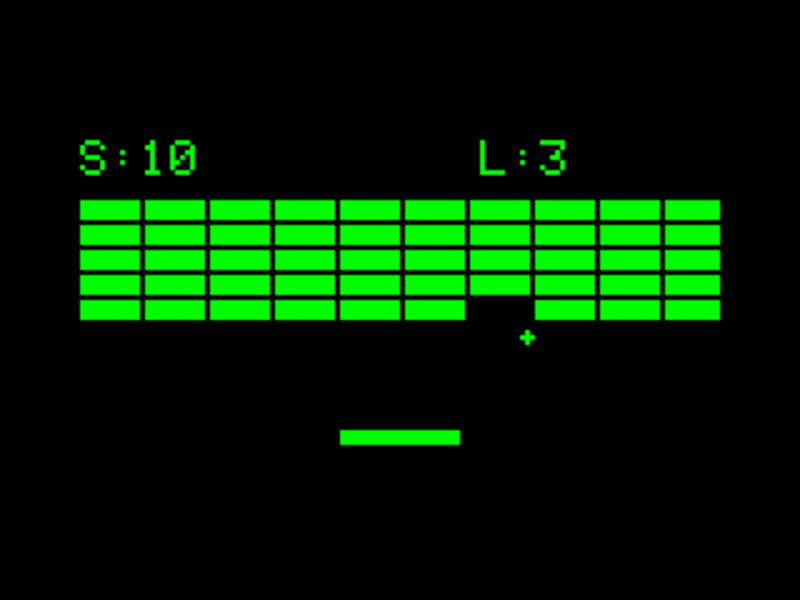

# Breakout

A simple Breakout clone for the Esposito Arduboy compatibility layer.

## How to Play

- **LEFT/RIGHT** (or A/D): Move paddle
- **A button** (or M): Restart after game over

## Features

- 5 rows of color-coded bricks (higher rows score more)
- 3 lives
- Ball angle changes based on where it hits the paddle
- Win screen when all bricks are cleared
