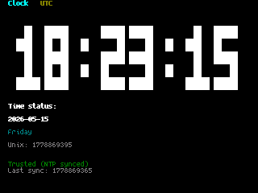

# Clock

A minimal UTC clock app for Esposito OS.



## What It Shows

- Current UTC date and time
- Current weekday
- Unix timestamp
- Whether the OS considers the time trusted for this boot
- Last NTP sync timestamp, if available
- Weather from Open-Meteo (temperature + condition) when WiFi is connected

## Notes

The app uses the OS time API, so it reflects the current system clock state:

- If WiFi is connected and NTP synced during this boot, time is marked trusted.
- If not, the app still shows the current system clock, but labels it untrusted.

## Controls

The display updates automatically every second.

- Any key redraws immediately
- `R` forces a weather refresh
- `Ctrl+Esc` returns to the launcher

## Build

From the repository root:

```sh
bash scripts/build_app.sh apps/clock/app.c
```

Then copy the generated ELF to:

```text
/sdcard/apps/clock/program.elf
```
