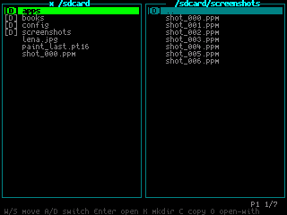

# File Manager

A directory browser for `/sdcard`.

## Current Features

- Two-pane (`mc`-style) browser under `/sdcard`
- Independent left/right pane paths
- Enter directory with `Enter` in active pane
- Go to parent directory with `ESC` in active pane
- Reload active pane with `R`
- Quick create directory in active pane with `K` (`newdir`, `newdir_2`, ...)
- Create empty file in active pane with `N`
- Rename selected file or directory with `M`
- Delete selected file or empty directory with `X`
- Copy selected file to other pane with `C` (auto-unique destination name)
- Open selected file with app association using `Enter`
- Handles ambiguous extensions (for example `.md`) via one-key choice (`1`/`2`)
- Persist pane paths and active pane between launches

## Controls

| Key | Action |
| --- | --- |
| W / S | Move selection |
| A / D or Tab | Switch active pane |
| Enter | Enter selected directory, or open selected file with associated app |
| ESC | Go to parent directory in active pane, or exit at `/sdcard` |
| R | Reload active pane |
| N | Create a new empty file in active pane |
| K | Create a new directory in active pane |
| M | Rename selected file or directory |
| C | Copy selected file to other pane |
| X | Delete selected file or empty directory |
| 1 / 2 | Resolve app choice when extension has multiple handlers |

## Notes

This implementation currently supports creating directories and files, renaming, deleting files or empty directories, and copying files. Directory copy, recursive delete, and picker mode are planned next.
