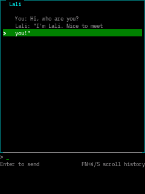

# Lali

A chat app for Esposito OS that talks to LLMs via OpenRouter.



## Configuration

Create `/sdcard/openrouter` with your OpenRouter API key:

```
sk-or-v1-xxxxxxxxxxxx
```

## Controls

- **Type** a message and press **Enter** to send
- **FN+W** / **FN+S** scroll chat history
- **Ctrl+Esc** returns to the launcher

## Notes

Lali sends a system prompt telling the model its name is Lali and to keep responses brief.

## Build

```sh
bash scripts/build_app.sh -l ui apps/lali/app.c
```

Then copy to SD card:

```text
/sdcard/apps/lali/program.elf
```
