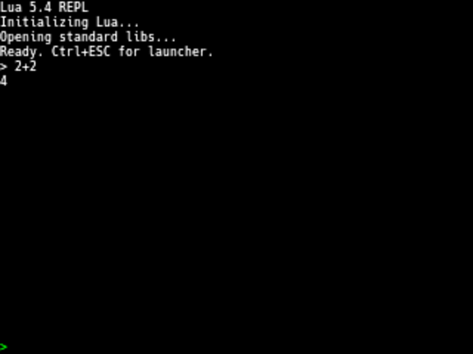

# Lua App

Interactive Lua 5.4 REPL and script runner for Esposito.

## Usage

Launch from the launcher to get an interactive REPL. Type Lua expressions or
statements at the `>` prompt:

    > 1 + 2
    3
    > string.upper("hello")
    HELLO
    > t = {a = 1, b = 2}
    > t.a
    1

Press Ctrl+ESC or type `exit`/`quit` to return to the launcher.

## Script Runner

Open a `.lua` file from the file manager to execute it as a script. The
script runs and results are displayed, then drops into the REPL.

## Esposito API

The `esposito` module provides bindings to the Esposito OS:

- **Display:** `clear()`, `print()`, `print_color()`, `print_attr()`, `flush()`,
  `get_cols()`, `get_rows()`, `set_cursor()`, `get_cursor()`, `fill_rect()`,
  `draw_pixel()`, `get_size()`, `draw_text()`, `draw_scaled_text()`
- **Input:** `keyboard_read()`
- **System:** `time()`, `load_app()`, `settings_get/set()`, `settings_get_int/set_int()`
- **Networking:** `wifi_connect()`, `wifi_is_connected()`, `wifi_scan()`, `http_get()`
