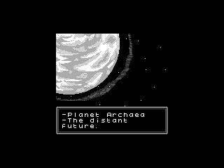

# Peanut-GB for Esposito

A Game Boy (DMG) emulator for the ESP32 Cheap Yellow Display, running as an Esposito OS app.

## About

This app uses [Peanut-GB](https://github.com/deltabeard/Peanut-GB) by Mahyar Koshkouei — a very fast, single-header Game Boy DMG emulator library written in C99. It runs at ~40-60 FPS on the ESP32 at 240MHz with no PSRAM.

ROMs are loaded from the SD card into flash memory and memory-mapped for zero-overhead reads. Bank 0 is cached in RAM to reduce flash cache contention.

## Controls

| Action       | Key |
|-------------|-----|
| D-Pad Up    | W   |
| D-Pad Down  | S   |
| D-Pad Left  | A   |
| D-Pad Right | D   |
| A Button    | L   |
| B Button    | M   |
| Select      | O   |
| Start       | P   |
| Save State  | K   |
| Load State  | J   |
| Exit        | ESC |

## ROMs

Place `.gb` files in `/sdcard/roms/` on the SD card. ROMs can also be opened via the file manager if associated with `.gb` or `.gbc` extensions.

For legal, homebrew Game Boy ROMs, visit the [Homebrew Hub](https://hh.gbdev.io/).

## Saves

- **SRAM**: Auto-saved to `<rom>.sav` alongside the ROM on exit (battery-backed save, like the real Game Boy)
- **State**: Save/load with K/J keys, stored as `<rom>.state` alongside the ROM

## Credits

- Emulator core: [Peanut-GB](https://github.com/deltabeard/Peanut-GB) by Mahyar Koshkouei (MIT License)
- Some code from [SameBoy](https://github.com/LIJI32/SameBoy/) by Lior Halphon (MIT License)
- Esposito OS app integration by Roberto Alsina

## License

MIT License — see [LICENSE](LICENSE).
