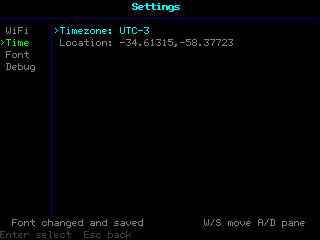

# Settings

System configuration app for Esposito OS.



## What It Configures

- WiFi network scan and selection workflow
- Manual SSID and password entry
- Save and connect to configured network
- Disconnect from WiFi
- Timezone setting
- Weather/location setting (city name or `lat,lon`)
- Default system font
- Serial log output toggle

## UI and Navigation

The main screen uses a two-column layout:

- Left pane: sections (`WiFi`, `Time`, `Font`, `Debug`)
- Right pane: options for the selected section

Keyboard controls on the main screen:

- `W` / `S`: move within the focused pane
- `A`: focus left pane
- `D`: focus right pane
- `Enter`: select/activate current item
- `Esc`: move focus back to the left pane

Modal screens (text input, scan list, font list) keep their own controls and return to the main layout when finished.

## Notes

- Font changes are applied immediately.
- After a font change, the Settings app re-lays out itself for the new grid size.
- Location accepts either direct coordinates (`40.4168,-3.7038`) or a city name (resolved via Open-Meteo geocoding).

## Build

From the repository root:

```sh
bash scripts/build_app.sh -l ui apps/settings/app.c
```

Then copy the generated ELF to:

```text
/sdcard/apps/settings/program.elf
```

And make sure the manifest is present:

```text
/sdcard/apps/settings/manifest.cfg
```
